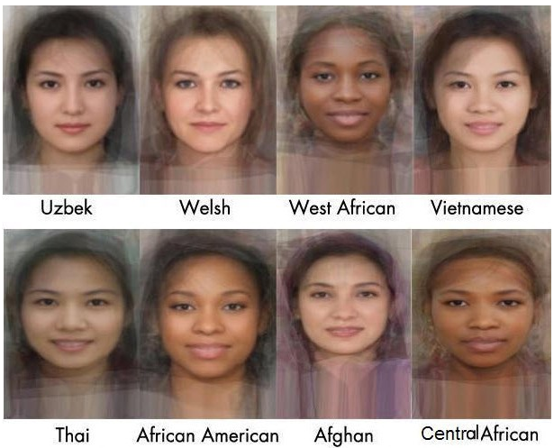
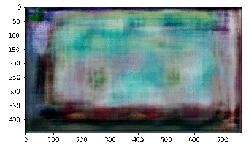

<h3 align="center">
  
</h3>

# VTRG Face Generator

Python notebook containing Keras TensorFlow GAN Network implementation. It was trained on a [Celebrities](https://www.kaggle.com/greg115/celebrities-100k) dataset.

Check out corresponding Medium article: [Face Generator - Generating Artificial Faces with Machine Learning 🧑](https://towardsdatascience.com/face-generator-generating-artificial-faces-with-machine-learning-9e8c3d6c1ead).

Check out corresponding Kaggle kernel: [Face Generator](https://www.kaggle.com/greg115/face-generator-dcgan-celebrities)
and (https://www.kaggle.com/bansalyash/div2k-hr) 

## DCGAN
Network architecture by [Wazir Muhammad et al., 2015](https://arxiv.org/abs/1511.06434).

## Training
Visualization of training with the following hyperparameteres.

	DATASET_SIZE = 100000
	IMAGE_SIZE = 128
	NOISE_SIZE = 100
	LR_D = 0.00004
	LR_G = 0.0002
	BATCH_SIZE = 64
	EPOCHS = 60
	BETA1 = 0.5
	WEIGHT_INIT_STDDEV = 0.02
	EPSILON = 0.00005

## Results

Generated samples after 60 epochs of training.

## Author

**Wazir Muhammad Laghari**

[**PORTFOLIO**](https://gsurma.github.io)

[**GITHUB**](https://github.com/niazwazir)

[**BLOG**](https://medium.com/@gsurma)

